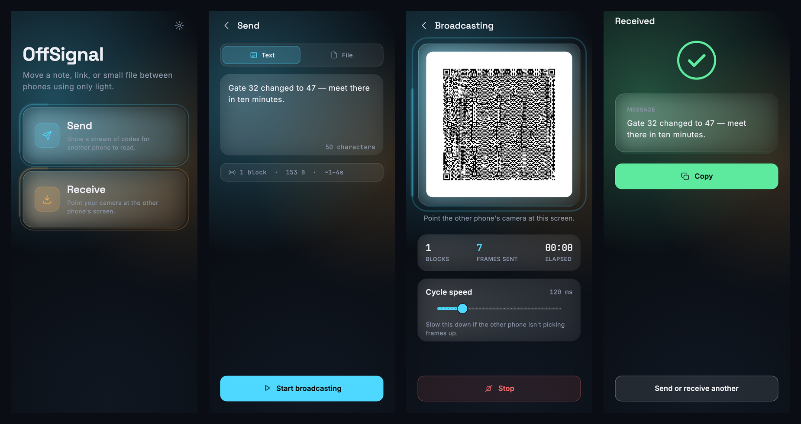
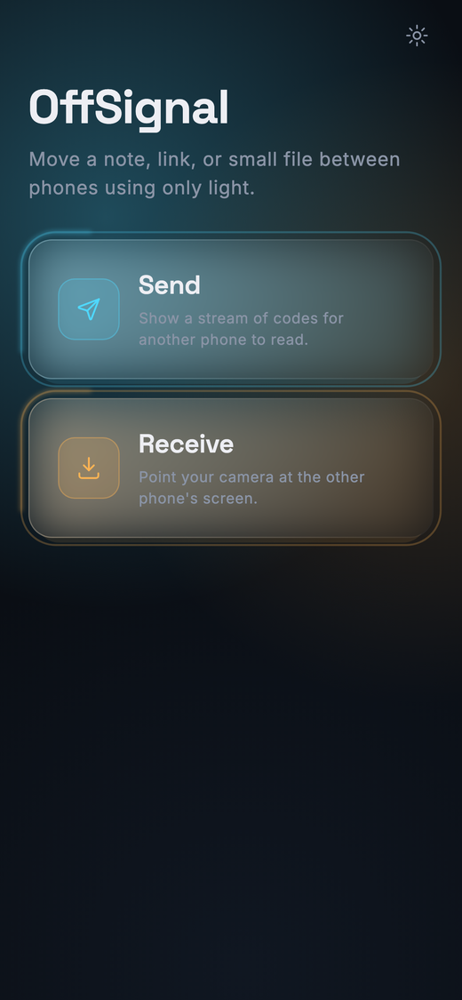
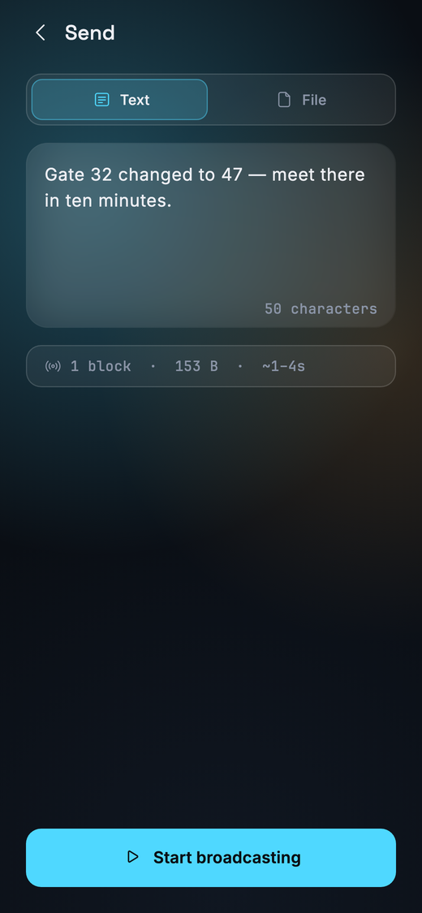
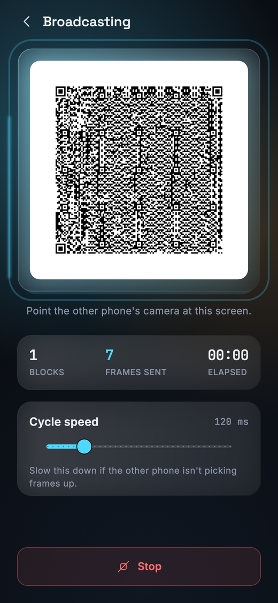
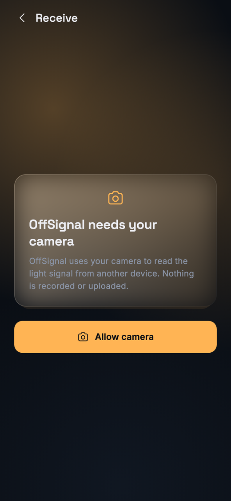
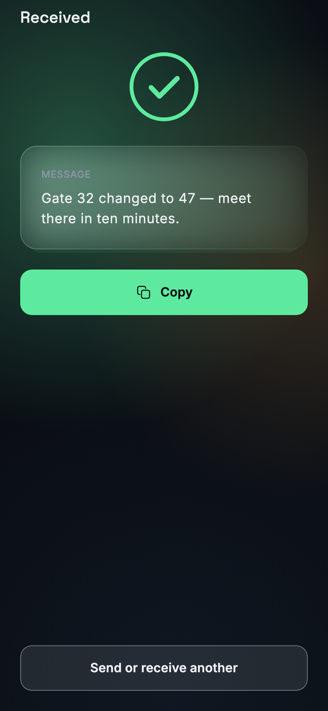
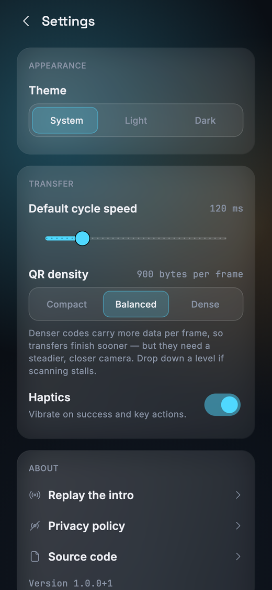
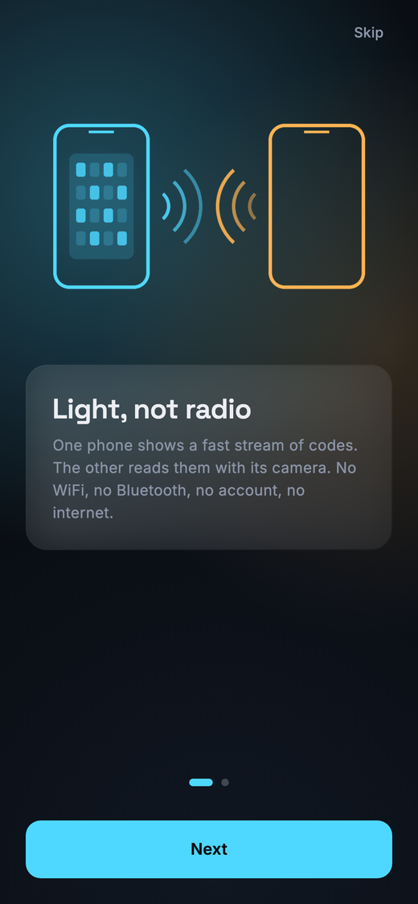
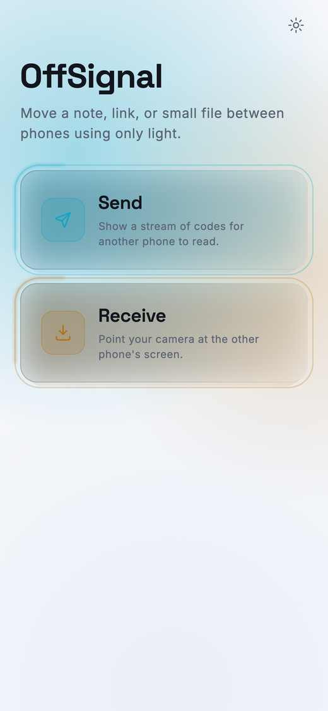

# OffSignal

**Move a note, link, or small file between two phones using only light.**

The sending phone displays a rapidly cycling sequence of QR codes. The receiving phone reads them
with its camera. No WiFi, no Bluetooth, no pairing, no server, no accounts — and no internet, ever.
It works on a plane, in a dead zone, between iOS and Android, and across an air gap.



---

## Why it exists

Every "quick, send me that file" path assumes infrastructure: a network, an account, a shared
ecosystem, or at minimum a working radio. OffSignal assumes a screen and a camera.

That constraint is also the design. The Android build requests exactly **one** permission — the
camera — and does not request internet access at all, so it *cannot* phone home even in principle.

## How it works

The transport is a **Luby Transform fountain code**. Rather than sending block 1, then block 2, and
retrying whatever got missed, the sender emits an endless stream of coded packets and never waits
for an acknowledgement. The receiver reconstructs the whole payload from any sufficient subset it
manages to scan. There is no back-channel, because there cannot be one.

```
your file
  → gzip, with a SHA-256 of the original sealed inside the compressed blob
  → split into K blocks
  → endless stream of XOR-coded packets
  → base64 → QR frame → screen → camera → decode → peel
  → SHA-256 verified before anything is ever shown as "received"
```

Three details make it work in practice rather than only on paper:

**Systematic rounds.** Pure LT peeling is all-or-nothing — nothing decodes until enough packets
land, then the entire payload resolves in one avalanche. That makes a progress bar useless. The
encoder instead emits repeating systematic rounds, so early packets each solve exactly one block and
progress climbs from the first frame. The rounds repeat rather than running once, so a receiver that
starts *after* the sender still gets bootstrapped.

**Integrity is a gate, not a hope.** The SHA-256 travels *inside* the compressed payload, so the
checksum is itself protected by the fountain code. A transfer is only ever reported as successful
after the recomputed hash matches. A corrupted payload cannot reach the result screen.

**Density is tunable.** Each QR carries 400, 900, or 1400 bytes depending on the QR density setting.
Denser codes finish sooner but demand a steadier, closer camera, so the trade-off is exposed to the
user rather than guessed at.

## Measured performance

A ~100 KB document, iOS sending and Android receiving, at the default Balanced density:

| | Blocks | Wall clock |
|---|---|---|
| Naive LT, 180 B per frame | 412 | 6 min 30 s |
| **Shipping: systematic rounds, 900 B per frame** | **114** | **37 s** |

| Density | Bytes / frame | QR version | Notes |
|---|---|---|---|
| Compact | 400 | v16 (81×81) | Most forgiving to scan |
| **Balanced** *(default)* | **900** | **v25 (117×117)** | Verified on real hardware |
| Dense | 1400 | v32 (145×145) | Fastest, needs a steady close camera |

## Screenshots

| Home | Compose | Broadcasting |
|:---:|:---:|:---:|
|  |  |  |

| Camera permission | Result | Settings |
|:---:|:---:|:---:|
|  |  |  |

| Onboarding | Light theme |
|:---:|:---:|
|  |  |

<sub>Rendered from the app's own golden tests, so they are real widget output at device resolution
rather than mockups.</sub>

## Install

**Android** — download the APK from [Releases](../../releases/latest) and open it. Android will ask
you to allow installs from your browser once, since OffSignal is not on the Play Store.

**iPhone** — open the web build in Safari, tap Share, then **Add to Home Screen**. There is no
native iOS build; the web build is the iOS story, and it is treated as a first-class target rather
than a fallback. See [Roadmap](#roadmap).

**Any browser** — the web build is the whole app, same code, and keeps working offline once loaded.

## Build from source

Requires Flutter 3.44+ on the stable channel. The repository is a pub workspace, so the Flutter app
lives in `packages/offsignal_app` rather than at the root. Drive everything from the root with the
Makefile:

```bash
make setup     # resolve dependencies across the workspace
make run       # run the app        (make run DEVICE=chrome to pick a device)
make test      # every suite: codec, tooling, app
make verify    # everything CI runs: analyze, format, guards, tests
make apk       # signed release APK, reported with its signing key and permissions
make web       # release web bundle
make help      # all targets
```

Running `flutter run` from the repository root will fail with `Target file "lib/main.dart" not
found` — that is the workspace layout, not a broken checkout. Use `make run`, or
`cd packages/offsignal_app` first. In VS Code, F5 is already wired up.

### Signing a release build

```bash
keytool -genkey -v -keystore offsignal-release.jks \
  -keyalg RSA -keysize 2048 -validity 10000 -alias offsignal
cp packages/offsignal_app/android/key.properties.example \
   packages/offsignal_app/android/key.properties   # then fill in paths and passwords
make apk
```

Keystores, `key.properties`, and passwords are gitignored and must never be committed. Without a
keystore the release build falls back to debug signing so local testing still works, and `make apk`
tells you which key it used. CI restores the real keystore from repository secrets.

## Layout

```
packages/
  offsignal_core/     pure Dart codec — zero Flutter dependency, runs under plain `dart test`
  offsignal_app/      the Flutter app: Android, web
  offsignal_tools/    repository guards that run in CI
tools/                brand asset generator, APK inspection helpers
screenshots/          images used by this README
```

`offsignal_core` deliberately has no Flutter dependency. That keeps the codec testable headlessly —
a 1000-run randomized soak finishes in under three seconds — and keeps transport logic away from UI
concerns.

## Testing

```bash
make test      # codec + tooling + app
make soak      # 1000 randomized send-to-receive runs through a lossy channel
make verify    # what CI enforces on every push
```

The codec suite includes property tests that reconstruct payloads byte-for-byte through up to 70%
simulated packet loss, adversarial tests asserting a corrupted transfer can *never* be reported as
successful, and golden tests pinning the glass theme in both light and dark.

CI additionally asserts that the built release APK requests no `INTERNET` permission, so that
guarantee is verified on the real artifact rather than trusted.

## Privacy

No file content, text content, or filename ever leaves the device. There is no analytics, no crash
reporting service, and no third-party SDK collecting anything. Errors are logged locally and record
only a screen name and a failure type — never message text, file contents, or file names.

The transferred payload exists in memory for the duration of a session and is never written to disk
beyond what the OS save/share sheet does at your explicit request.

## Roadmap

- **Native iOS** — deferred until an Apple Developer account is available. Nothing in the
  architecture needs to change to enable it; iOS is fully served by the web build meanwhile.
- **Denser frames via base45** — QR alphanumeric mode carries ~23% more data per frame than base64
  in byte mode. Currently blocked on the upstream `qr` package not exporting its alphanumeric datum.
- **Adaptive speed** — auto-tuning cycle rate without a back-channel. A `SpeedController` extension
  point exists in `offsignal_core`; only the manual implementation ships today.
- Robust soliton tuning, multi-file batches, and a multi-colour QR alphabet are all out of scope for
  now.

## License

[MIT](LICENSE).

Bundled fonts — Inter, Space Grotesk, and JetBrains Mono — ship under the SIL Open Font License;
their license texts are vendored alongside them in `packages/offsignal_app/assets/fonts/`.
